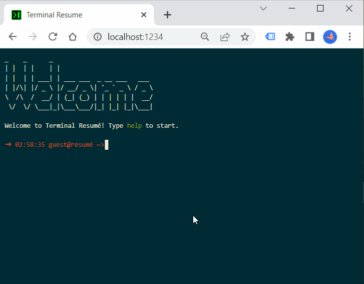

# terminal-resume

Turn your resume into a terminal-based website.

## Features

* Supports valid resume in [JSON resume format](https://jsonresume.org/)
* Customizable commands and sections
* Auto-complete, other terminal features from [JQuery Terminal](https://terminal.jcubic.pl/)
* Implement your own commands to flex your programming skills

## How to Use

1. Fork and clone the repository
2. `npm install`
3. Replace js/resume.json with your own resume in JSON resume format
4. (Optional) customize, see the Customization section
5. `npm run dev` to run locally
6. `npm run zip` to zip a production package
7. Deploy the zip as static website to your favorite hosting solution

## Customization 

- To map different sections to different commands, checkout `SectionCommands` in [config.ts](js/config.ts)
- To change color, look into [custom.css](css/custom.css) and `FontStyle` in [config.ts](js/config.ts)
- Want to add your own commands? checkout `customCommands` in [main.ts](js/main.ts) and [JQuery Terminal Docs](https://terminal.jcubic.pl/)

## License

[MIT](https://choosealicense.com/licenses/mit/)
